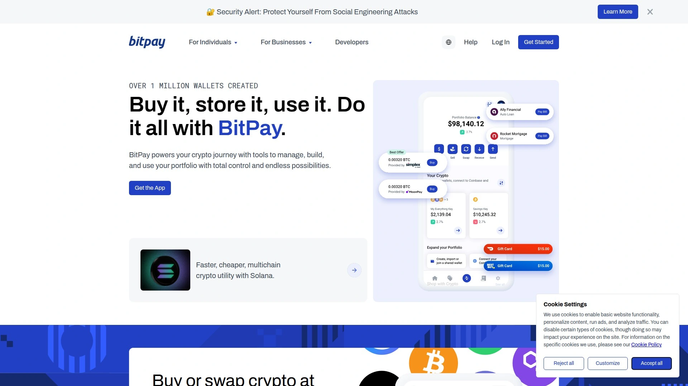

# 2025年十二大最佳加密货币支付网关平台

跨境电商卖家每笔信用卡支付被扣掉3-5%手续费,拒付率高达15%,资金到账要等3-7天。博彩、成人内容、高风险行业根本申请不到传统支付通道,好不容易找到愿意接的处理商,费率高得离谱。加密货币支付网关正在改变这个局面——手续费低至0.5-1%,没有拒付风险,资金即时到账,支持300多种数字货币,全球任何地方的客户都能付款。这份榜单按手续费、支持币种、集成难度、安全性综合排序,涵盖从开源自托管到企业级托管的12个平台,帮你找到最适合自己业务的加密货币收款解决方案。

## **[NOWPayments](https://nowpayments.io)**

市场最低手续费的非托管支付网关,支持300多种加密货币,Forbes评选的2025年最佳。

NOWPayments在2025年被Forbes评为最佳加密货币支付网关,核心优势是非托管模式——你完全掌控自己的资金,不需要把钱转给第三方。手续费只有0.5-1%,是市场上最低的费率之一。支持超过300种加密货币和75种法币,几乎涵盖所有主流和小众币种。

自动法币转换功能能保护你免受加密货币价格波动影响——客户用任何加密货币付款,你收到的是你指定的稳定法币。批量处理能力强,一次最多处理1000笔交易。集成方式灵活,提供API、插件、发票、捐赠按钮等多种选择,主流电商平台都能快速接入。

实时分析仪表盘提供全面的交易洞察和报告工具,所有交易记录一目了然。24/7客户支持确保任何时候遇到问题都能得到帮助。AML反洗钱措施保护你的业务合规安全。双重验证、多账户角色管理、白名单功能让资金安全得到多层保障。

特别适合赌场、交易平台、成人业务、iGaming、代币发行活动、电商、SaaS、市场平台、慈善机构等各类场景。支持超过100个加密钱包。对于想要灵活、安全且成本最低的商家,NOWPayments的非托管方式和广泛的加密货币支持是理想选择。

## **[BitPay](https://bitpay.com)**

历史最悠久的加密货币支付处理商,企业级可靠性,适合美国和欧洲合规敏感商家。

BitPay是运营时间最长的加密货币处理商之一,在行业内建立了可信赖的声誉。提供强大的发票系统、退款处理、会计导出和法币结算功能。分层定价和清晰的政策适合重视合规的团队。

与Shopify、WooCommerce等主流电商平台轻松集成。品牌化结账链接能让支付页面符合你的品牌形象。部分和完全退款功能让售后处理更灵活。批量支付功能适合需要给多个接收方同时转账的场景。

支持多种货币结算,包括稳定币。用户界面友好,即使不精通技术也能轻松导航。提供多种加密货币支持,让你能满足不同客户偏好。交易手续费为1-2%加每笔0.25美元。

适合美国/欧盟零售商、订阅服务、数字商品、B2B发票场景。如果你想要可预测的费用和传统客户支持而不是最大化币种多样性,BitPay是稳妥选择。全球覆盖范围广泛。

## **[Coinbase Commerce](https://coinbase.com/commerce)**

Coinbase出品的商家支付工具,简洁的USDC结账体验,类似法币的报告功能。

Coinbase Commerce来自全球最大最可信的加密货币交易所之一Coinbase,建立在其成熟的品牌声誉之上。支持主要加密货币,包括比特币、以太坊等。用户界面直观,仪表盘简化了管理加密货币支付的流程,即使不精通技术也能轻松使用。

与其他充当中介的支付处理商不同,Coinbase Commerce让你完全掌控加密货币支付——资金直接到你的钱包。这提高了安全性并减少对第三方的依赖。与热门电商平台和内容管理系统集成简单,无论你用Shopify、WooCommerce还是自定义网站,添加Coinbase Commerce作为支付选项都很直接。

可定制结账体验让你能调整支付流程以匹配品牌形象,为客户创建流畅的用户体验。清晰的商家仪表盘、简单的支付链接,以及与Coinbase生态系统和USDC流的整洁集成。链上支付协议支持自动转换。

特别适合SaaS、创作者和已经使用Coinbase的初创公司。如果你的团队已经熟悉Coinbase平台,Commerce能无缝融入现有工作流程。

## **[CoinGate](https://coingate.com)**

快速支付处理的加密货币网关,支持70多种币种,欧洲商家友好。

CoinGate以其广泛的加密货币支持和易用性而排名靠前。提供近乎即时的支付处理,对于处理全球客户的商家非常有吸引力。支持超过70种加密货币,为客户提供广泛选择。

设置过程简单快速,不需要深厚的技术知识。与主流电商平台集成顺畅,包括WooCommerce、Shopify、Magento等。提供实时汇率转换,确保定价准确。

商家可以选择以加密货币或法币接收结算,灵活性高。自动发票生成简化了账务管理。提供详细的交易报告和分析工具。

不过大交易量商家需要通过KYC流程,这对重视隐私的用户可能是个问题。隐私功能不如某些专注匿名的平台。如果你需要快速支付和多种加密货币支持,且能接受KYC要求,CoinGate是可靠选择。

## **[CoinPayments](https://coinpayments.net)**

老牌多币种支付网关,支持2000多种加密货币,适合需要广泛币种选择的商家。

CoinPayments是历史悠久的加密货币支付处理商,以支持的币种数量众多而闻名。超过2000种加密货币和代币的支持让它成为币种多样性方面的领导者。

提供购物车插件、支付按钮、API集成等多种接入方式。商家可以接收160多种法币的结算。自动货币转换功能让你能接受各种加密货币但以指定币种收款。

Vault存储功能为资金提供额外安全保障。点对点交易允许商家之间直接转账。批量支付工具适合需要同时向多个收款方付款的场景。

交易手续费相对竞争对手略高,但币种支持的广度可能值得这个溢价。特别适合接受小众代币支付或者服务国际化客户群体的商家。

## **[Plisio](https://plisio.net)**

注重隐私的低费率支付网关,0.5%手续费,批量支付节省80%费用。

Plisio的费用结构非常有吸引力——只收取0.5%的手续费。批量支付功能能把所有交易合并在一起处理,节省高达80%的网络费用。零拒付风险——区块链上的交易无法取消或撤销。

隐私保护做得很好,不需要身份证明,不保留交易详情。支持8种最常见的加密货币,包括比特币、以太坊、莱特币、达世币、狗狗币、Zcash、比特币现金和门罗币。可以轻松将收到的加密货币转换为160多种法币。

提供API、发票、插件、批量支付等支付工具。遵循White Label概念——客户支付时不会离开你的网站。24/7技术支持确保任何时候遇到问题都能解决。

2分钟即可完成设置,2次点击就能免费注册。适合金融、电商、高风险、在线零售、自由职业、市场平台、非营利、成人内容、创作者、游戏等各类业务需求。特别适合众筹项目。

## **[Triple-A](https://triple-a.io)**

对初学者最友好的加密货币支付网关,0.8%手续费,不需要编程知识。

Triple-A的设置极其简单,用户不需要任何编程知识就能组装加密货币支付网关。是市场上最消费者友好的选项之一。同时也提供WooCommerce插件和仅API集成方式供复杂设置使用,所以不只是为初学者准备。

每笔交易都会发送电子邮件通知,让你随时掌握收款动态。手续费为0.8%,不收取管理和配置的额外费用。支持银行级安全标准。提供超过800种代币选择。

服务以多种语言提供,方便国际化团队使用。支持稳定币和数字货币支付。与主流电商平台集成顺畅。

特别适合没有技术背景但想接入加密货币支付的小企业和个人商家。界面清晰直观,学习曲线平缓。

## **[BTCPay Server](https://btcpayserver.org)**

开源自托管的比特币支付处理器,零手续费,完全去中心化。

BTCPay Server是开源且可自托管的支付处理解决方案,让商家能完全掌控支付流程。最大的优势是零手续费——除了区块链网络费用外,不收取任何额外费用。

完全去中心化,不依赖任何第三方服务,资金直接到你的钱包。隐私保护做到极致,不会收集或分享任何客户数据。支持比特币和闪电网络,交易确认快速。

需要自己托管服务器,对技术能力有一定要求,但社区文档完善。与WooCommerce、Shopify、Magento等主流平台都有插件。支持PoS终端,线下店铺也能使用。

适合重视隐私、想要完全控制且有技术能力的商家。虽然设置复杂度高于托管方案,但长期来看能节省大量手续费。社区驱动的开发模式确保持续改进。

## **[Confirmo](https://confirmo.net)**

企业级加密货币支付解决方案,强调合规和安全,适合传统企业。

Confirmo提供企业级的加密货币支付基础设施,特别注重监管合规和安全性。支持主流加密货币和稳定币。为大交易量商家提供专门的账户管理服务。

集成API功能强大,能深度定制以满足企业特定需求。实时汇率锁定功能避免价格波动风险。详细的交易报告和分析工具帮助财务团队做账。

符合欧盟和国际反洗钱法规,适合需要合规保障的传统企业。客户支持团队专业,能提供技术和业务咨询。定价根据交易量定制,大客户有议价空间。

## **[ForumPay](https://forumpay.com)**

专注数字商品和服务的加密货币支付网关,即时结算,无波动风险。

ForumPay专为数字商品、在线服务、SaaS订阅等场景优化。即时结算功能让商家能立刻使用收到的资金。自动货币转换避免加密货币价格波动带来的风险。

支持主流加密货币和稳定币,覆盖大部分客户需求。与数字内容平台、在线课程平台集成简单。订阅计费功能支持周期性扣款。

一键支付体验让客户结账流程顺畅,提高转化率。实时通知确保商家随时知道收款状态。适合软件公司、在线教育、数字内容创作者、SaaS平台。

## **[B2BinPay](https://b2binpay.com)**

大额交易优化的企业级支付网关,交易量越大手续费越低。

B2BinPay支持所有热门加密货币和稳定币,总共19种不同的加密货币可用于支付。最大特色是阶梯式费率——交易量越大,手续费越低。

普通币种手续费从0.5%起,可以降到0.35%。代币手续费也类似递减。稳定币手续费从1%到0.85%不等。提供加密货币转换服务。

支持提现到加密钱包和银行账户。全球任何地方都能使用,没有地域限制。适合B2B企业、大宗商品交易、跨境贸易商。

企业级安全措施保护大额交易安全。专属客户经理提供定制化服务。合规团队确保符合各地监管要求。

## **[Stripe (Crypto)](https://stripe.com)**

传统支付巨头的加密货币解决方案,Shopify合作推出USDC支付。

Stripe与Shopify深度合作,让数百万商家能接受稳定币支付。从2025年6月起,Shopify商家能在34个国家接受USDC支付。购物者可以使用自己喜欢的加密钱包在Base区块链上用USDC付款。

默认情况下,Stripe允许商家以本地货币接收稳定币支付,直接存入银行账户就像其他支付方式一样。商家也可以选择将资金作为USDC直接转移到外部钱包。在过去两年里,全球稳定币支付结算额超过940亿美元,月支付量从不到20亿美元增长到超过63亿美元。

Stripe Connect平台让使用Connect的平台(如DoorDash、Instacart、Salesforce)也能为其用户开启稳定币支付。适合已经使用Stripe的商家,能无缝添加加密货币支付功能。帮助企业以更低成本触达更多市场。

***

## 常见问题

**加密货币支付网关的手续费真的比信用卡低吗?**

绝对低很多。传统信用卡支付手续费通常在3-5%之间,还要承担15%左右的拒付风险。加密货币支付网关的费率普遍在0.5-2%之间——NOWPayments只收0.5-1%,Plisio和B2BinPay也是0.5%起,Triple-A是0.8%。更重要的是区块链交易无法撤销,零拒付风险意味着你不会因为恶意退款损失商品和钱。资金即时到账,不像信用卡要等3-7天。对于大交易量商家,手续费差异每年能节省数万甚至数十万美元。

**自托管和托管型加密货币支付网关该选哪种?**

看你的技术能力和控制需求。自托管如BTCPay Server完全免费,资金直接到你的钱包,隐私保护最强,但需要自己架设服务器和维护。托管型如NOWPayments、BitPay、Coinbase Commerce使用简单,2-5分钟就能接入,有专业客服支持,但要支付0.5-2%手续费。如果你是技术团队且每月处理大量交易,自托管长期省钱;如果你是小商家或非技术背景,托管型的便捷性更重要。部分商家两种都用——日常小额用托管型方便快捷,大额交易用自托管节省费用。

**博彩、成人内容等高风险行业能用加密货币支付吗?**

能,这正是加密货币支付的核心优势之一。传统支付处理商通常拒绝服务博彩、成人内容、CBD、高风险金融等行业,即使接受费率也极高。NOWPayments明确支持赌场、成人业务、iGaming等场景。Plisio也针对高风险、成人内容、众筹等提供服务。加密货币支付的去中心化特性意味着没有中心化机构能拒绝你的交易。不过要注意各国法律法规——确保你的业务在运营地合法,并选择支持你所在行业的支付网关。

---

## 结语

这12个平台按手续费、币种支持、安全性、集成难度综合排序,从免费开源到企业级托管都有覆盖。如果你的业务正被传统支付通道的高费率和拒付率困扰,或者因为行业限制根本申请不到支付服务,**[NOWPayments](https://nowpayments.io)**的市场最低费率和非托管模式能让你在几分钟内开始接受加密货币支付——它支持300多种币种满足全球客户需求,0.5-1%的手续费比信用卡便宜80%以上,自动法币转换避免价格波动风险,零拒付保护你的收入,24/7客服和完善的安全措施让你专注业务增长而不用担心技术问题。
